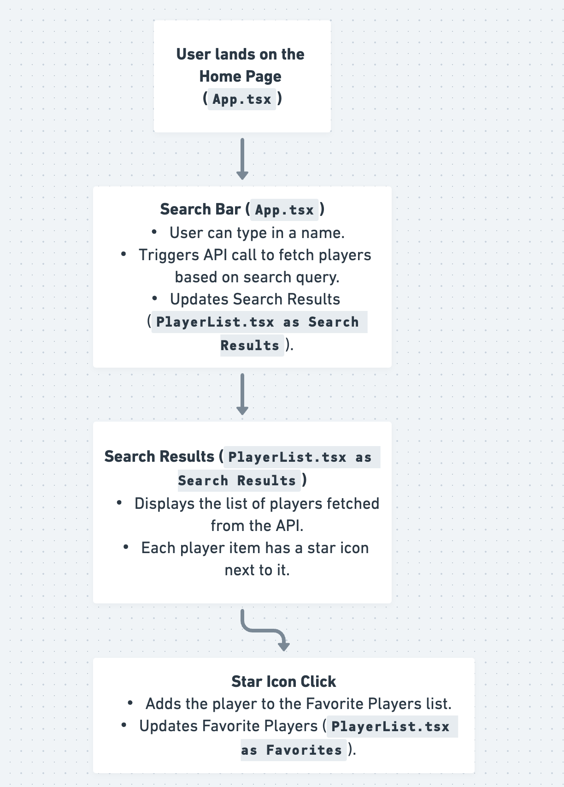

# NBA Players

A simple React application to display current NBA players and manage favorite players. Built with TypeScript, React Hooks, and SASS for styling.

## Features
- Fetch and display a list of current NBA players from an API.
- Search for players by name.
- Mark players as "Favorite" and view them in a separate list.
- Ability to change the background color of the favorites list.

## Tech Stack
- React
- TypeScript
- SASS
- Axios for API requests
- Rsuitejs for UI components

## Prerequisites
- Node.js >= 14.x
- npm >= 6.x

# Installation
Clone the repository
```
git clone https://github.com/eyalrosen20/nba-players.git
```
Navigate to the directory
```
cd nba-players
```
Install dependencies using npm:
```
npm install
```

Run the application:
```
npm start
```
The application will run on http://localhost:3000 by default.

## Components Breakdown

**App.tsx** 
- Fetches and shows the list of NBA players that match the search criteria from the API.
- Has a search textbox.
- Displays the PlayerList component twice, both for showing the search results and for the favorites list.

**PlayerList.tsx (as search results)** 
- Show the search results returned from the API and click on star to add to favorite.

**PlayerList.tsx (as favorites)** 
- Show the list of favorite players and unstar them.

# Flow Diagram

